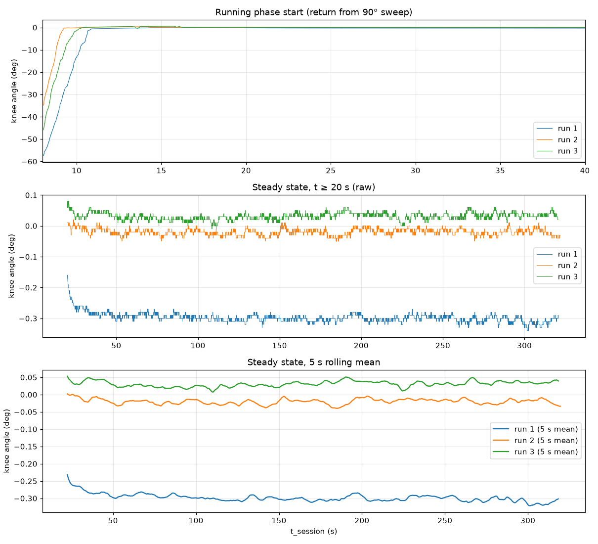
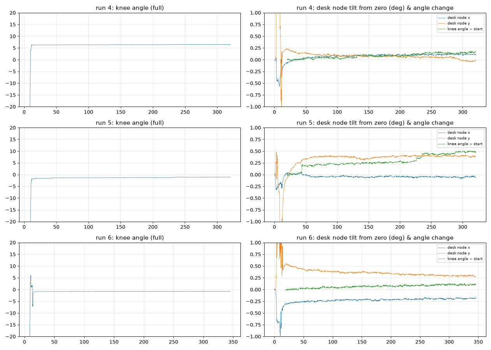

# Static stability test — findings

> A cleaned-up summary of these results is in [REPORT.md](REPORT.md). This file is the
> detailed working record.

**Logger:** `knee_gui.py` (CSV session output)
- **Session 1 (§1–6):** 2026-09-23, flat desk. `knee_static_1.csv` – `knee_static_3.csv` (≈5 min each)
- **Session 2 (§7):** 2026-09-24, raised rig (desk node ~1 cm higher than the ruler node, ~5 cm apart), central
  emit-timer fix flashed. `knee_static_4.csv` – `knee_static_6.csv` (≈5–5.5 min each)

## Headline

At rest the prototype is **very stable**: jitter is ~0.01° SD, drift is effectively
zero (≤0.005°/min), and there were no dropouts. Between runs the resting value
differed by up to 0.33°, which is most likely how the ruler was set back down,
not sensor error. **Caveat:** in this setup only the ruler-side (shank) node
contributes to the angle — see [§4.3](#43-only-the-shank-node-was-actually-tested).

A second session on a raised rig (§7) repeated the same short-term noise and link
reliability at a non-level, non-zero resting pose. Its drift and offsets are
dominated by the rig moving, and the central emit-timer change did not fix the
~23 ms sample period.

The configured 50 Hz was effectively ~40 Hz in the logged data (~43.5 Hz from the
board, ~20 % duplicate CSV rows). This doesn't change any static result (§5), but it
must be fixed before dynamic testing.

## 1. Setup

- **Thigh node** taped to the desk (never moves).
- **Shank node** taped to a ruler lying flat on the desk.
- Calibration (same for every run, see `knee_gui.py` / `knee_collector_uart.py`):
  1. **Zeroing** (0–2 s): both nodes flat and still → each node's zero gravity
     direction `d_i`.
  2. **Sweep** (2–8 s): ruler rotated ~90° and returned → each node's in-plane
     forward axis `f_i` (only learned if the node tilts > 5°).
  3. **Running** (≥ 8 s): angle = `incl_thigh − incl_shank`.
- Ruler then left flat on the desk for the remainder of the 5 min.

The two nodes are not exactly coplanar (the ruler raises one), but the angle is
relative to the zeroing pose, so that constant offset is calibrated out.

## 2. Method

- **Trim:** analysis uses `t_session_s ≥ 20 s`, excluding the calibration and the
  return from the sweep. 20 s was chosen from the test procedure (time needed to
  lay the ruler back down and let go).
- **Metrics per run:**
  - **Mean** — offset from the calibrated zero (return-to-zero error).
  - **SD** — short-term jitter.
  - **Min–max range** — worst-case spread.
  - **Linear drift** — slope of a least-squares line (°/min) and total change over
    the window.
  - **Detrended SD** — noise after removing the drift line.
  - **30 s block means / SDs** — low-frequency wander.
  - **Allan deviation** — how noise averages down across time scales
    (computed on de-duplicated source samples, see §4.6). See §3.2 for what it means.
  - **Link / timing health** — `status`, `rtt_us` (shank packet age), row spacing,
    duplicated `t_thigh_us`.

Reproduce with `stats.py` and `plot.py` in this folder (place the three CSVs next
to them; needs `numpy pandas matplotlib`).

## 3. Results

### 3.1 Steady-state stability (t ≥ 20 s)

| Metric | Run 1 | Run 2 | Run 3 |
|---|---|---|---|
| Samples | 15 038 | 15 099 | 15 039 |
| Mean (offset) | −0.298° | −0.020° | +0.031° |
| SD | 0.015° | 0.011° | 0.011° |
| Min / max | −0.34° / −0.16° | −0.05° / +0.02° | −0.01° / +0.08° |
| 2.5th–97.5th percentile | −0.32° … −0.26° | −0.04° … 0.00° | +0.01° … +0.05° |
| Drift slope | −0.0054 °/min | −0.0003 °/min | +0.0013 °/min |
| Total drift over window | −0.027° | −0.002° | +0.007° |
| Detrended SD | 0.013° | 0.011° | 0.011° |
| 30 s block SD (typical) | 0.004–0.011°* | 0.005–0.012° | 0.005–0.012° |
| Spread of 30 s block means | −0.27 … −0.31° | −0.01 … −0.04° | +0.02 … +0.04° |

\*Run 1's first block (20–50 s) had SD 0.024° (a ~0.07° step in the first ~30 s,
attributed to the ruler/tape shifting while the setup settled).

**Across runs:** SD of the three run means = 0.18°, range = 0.33° (run 1 is the
outlier; runs 2 and 3 agree within 0.05°).

### 3.2 Allan deviation

Allan deviation answers: *if I average the signal over τ seconds, how much do
consecutive averages differ?* The data is cut into back-to-back blocks of length τ,
each block is averaged, and σ(τ) = √(½·mean[(next block − this block)²]).
- Falling with τ → white noise; averaging helps.
- Flat → the noise floor (bias instability); averaging longer no longer helps.
- Rising with τ → drift / random walk; the longer you wait, the further it wanders.

Unlike a single SD, it separates short-term jitter from long-term drift.

| Averaging time τ | Run 1 | Run 2 | Run 3 |
|---|---|---|---|
| 0.1 s | 0.0027° | 0.0027° | 0.0027° |
| 1 s | 0.0048° | 0.0045° | 0.0045° |
| 10 s | 0.0065° | 0.0063° | 0.0049° |
| 30 s | 0.0061° | 0.0045° | 0.0053° |
| 60 s | 0.0070° | 0.0038° | 0.0056° |

Flat at ~0.004–0.007° from 10 to 60 s: no rising (drift) branch is visible at
these time scales. (The small rise from 0.1 s to 1 s comes from consecutive
samples being strongly correlated — the Mahony filter smooths the signal and the
output is quantised to 0.01°, see §4.1 — not from drift.)

### 3.3 Link and timing

| | Run 1 | Run 2 | Run 3 |
|---|---|---|---|
| Valid samples (running phase) | 100 % | 100 % | 100 % |
| Shank packet age ≤ 100 µs | 63 % | 63 % | 63 % |
| Shank packet age 5–15 ms | 34 % | 36 % | 37 % |
| Shank packet age > 15 ms (≈22 ms) | 2.4 % | 1.4 % | 0.5 % |
| Unique source samples / s | 40.5 | 40.5 | 40.2 |
| Duplicate rows (same `t_thigh_us`) | 19 % | 19 % | 20 % |

*Top: return from the 90° sweep at the start of the running phase. Middle: raw
steady-state signal. Bottom: 5 s rolling mean.*

## 4. Observations

### 4.1 Noise is at the logging resolution
`knee_angle_deg` is written with 2 decimals and ~90 % of consecutive samples are
identical; the quaternion columns (4 decimals) resolve only ~0.01° as well. The
measured SD of ~0.011° is therefore an **upper bound** — the true sensor noise is
probably lower. Log more decimals (e.g. `.4f` for the angle, `.6f` for quaternions)
to measure the real noise floor.

### 4.2 No meaningful drift
A fitted slope is always non-zero on real data, so its existence alone doesn't
mean the sensor drifts. Here the evidence says it doesn't:
- Slopes are tiny and **change sign** between runs (−0.005, −0.0003, +0.001 °/min).
  Excluding the first 30 s (t ≥ 50 s) they are −0.003, +0.001, +0.003 °/min.
  That is noise, not a consistent trend.
- Total change over ~5 min is ≤ 0.03°, about the size of the 0.01° logging step.
- Allan deviation has no rising branch up to τ = 60 s (§3.2).
- By design the tilt is **anchored to the accelerometer's measurement of gravity**, so it
  can't build up error the way heading (yaw) does (§4.5). Anything left would be
  slow and bounded, e.g. accelerometer bias shifting with temperature, not a
  steady slide.

Extrapolating a 5-minute slope to hours isn't valid. The data supports "no
detectable drift over 5 min"; a 30–60 min static run is needed to claim more.

### 4.3 Only the shank node was actually tested
`incl_thigh_deg` is exactly 0.00 for every running-phase sample. The desk node
never tilted > 5° during the sweep, so `estimate_forward` returned `None` and the
code treated the thigh as fixed (knee = −shank inclination). The reported angle
therefore reflects **only the ruler node's** gravity tilt; the desk node's noise
and drift are not in these numbers. To characterise the full two-sensor difference,
tilt both nodes during the sweep.

### 4.4 Offset vs. true error
Run 1's −0.30° offset is ~20× its SD, so it is a real difference in resting pose,
not noise. The calibration data (§4.7) shows the ruler really did end up in a
different place: run 2's zero pose matches the pose run 1 ended in to within
0.03°. A fixture with a hard stop would still be needed to measure the sensor's own
return-to-zero error independently.

### 4.5 Heading (yaw) drift does not leak into the angle
Yaw from the raw quaternions drifts ~5 °/min on the thigh node and 1.7–3.5 °/min on
the shank node (expected for 6-DOF fusion with no magnetometer), and the two nodes
drift at different rates. The knee angle is flat regardless — this directly
confirms the method's yaw-invariance by design.

### 4.6 Timing
- No dropouts or forward-filled samples in any run.
- **Duplicate rows are copies, not repeated measurements.** `t_thigh_us` is the
  central board's `micros()` stamp for each fused sample, so two different
  measurements can never share it, even if their values are identical. The GUI
  writes a row every 20 ms (50 Hz) using whatever sample is newest. When no new
  packet has arrived since the last row, it writes the same one again.
- **The source runs slower than 50 Hz, not faster.** The central firmware emitted
  every ~22.9 ms (~43.6 Hz) instead of 20 ms. `central_imu.ino` reset
  `lastEmitUs = tnow`, so any lateness in noticing a due tick was added to the
  next period. Because PC-side timing also jitters (row spacing median 16 ms),
  some rows repeat a sample and some source samples are overwritten before being
  logged (~40.5 unique/s logged vs ~43.6 produced).
  *Attempted fix after this test:* the emit timer now advances on a fixed schedule
  (`lastEmitUs += EMIT_PERIOD_US`, banner `gated-50hz-sched`). **Session 2 showed
  no change** (§7.2), so the lateness isn't small drift building up: each pass
  through the emit code takes ~23 ms.
- The fix is not to lower the rate. Either (a) match the source to the 50 Hz
  grid (firmware fix above), or (b) log one row per *received* sample instead of
  on a fixed grid. For analysis, **de-duplicate on `t_thigh_us`**.
- **Shank packet age takes only three values:** ~11 µs (62 %), ~10.6–10.9 ms (36 %)
  and ~22 ms (1.4 %), with nothing in between. Packets arrive every ~20 ms on
  their own clock, so a smooth spread of ages would be expected if the central's
  loop checked the link continuously. The gaps suggest the loop is only checking
  about every ~10.6 ms, i.e. something inside each loop pass blocks for ~10 ms.
  That would also explain the ~22.9 ms period (≈ two passes plus the emit work),
  and it limits what the schedule fix can do: the average rate becomes 50 Hz, but
  individual gaps would alternate around ~10.6 / ~21 ms rather than a steady 20 ms.
  Session 2 confirmed the same pattern (§7.2).
- Board clock vs PC wall clock differed by ~0.22 % (300.07 s vs 300.73 s). Irrelevant
  here, but matters for long synchronised recordings.

### 4.7 What the calibration data shows
The zeroing and sweep samples are in the CSV, so each run's calibration vectors
(`d_i`, `f_i`) can be recomputed with the repo's own functions (`calibration.py`).

| | Run 1 | Run 2 | Run 3 |
|---|---|---|---|
| Max shank tilt during sweep | 88.7° | 89.5° | 89.7° |
| Shank motion inside the 2 s zeroing window (mean / max) | 0.008° / 0.019° | 0.012° / 0.068° | 0.008° / 0.016° |
| Desk node tilt during sweep (max) | 0.38° | 0.33° | 0.39° |
| Desk node tilt, t ≥ 20 s (mean ± SD) | 0.044 ± 0.011° | 0.078 ± 0.010° | 0.018 ± 0.008° |

| Comparison | Run 1 vs 2 | Run 1 vs 3 | Run 2 vs 3 |
|---|---|---|---|
| Shank zero direction `d_shank` differs by | 0.62° | 0.50° | 0.33° |
| Desk zero direction `d_thigh` differs by | 0.05° | 0.07° | 0.08° |
| Shank forward axis `f_shank` differs by | 2.9° | 3.0° | 0.1° |

| Continuity between runs | Run 1 end → run 2 zero | Run 2 end → run 3 zero |
|---|---|---|
| Shank pose change | 0.06° | 0.13° |
| Desk node pose change | 0.02° | 0.02° |

What this supports:
- **The zeroing hold was clean.** The shank moved < 0.02° inside the 2 s window
  (run 2 had a 0.07° blip), so noise in `d_i` is negligible.
- **The zero pose itself varied by 0.3–0.6° between calibrations** because of where
  the ruler lay, while the untouched desk node agreed with itself within 0.08°
  across ~17 min. Each run's "0°" is simply wherever the ruler was lying.
- **Run 1's −0.30° offset was a real move of the ruler, and it stayed put.** Run 2 zeroed on almost
  exactly the pose run 1 ended in (0.06° apart; +0.33° vs +0.30° in run 1's frame).
- **The sweep direction doesn't matter for a test at 0°.** Run 1 swept along an axis
  ~3° off runs 2 and 3. Near 0° the angle depends almost only on `d_i`; an error in
  `f_i` scales the reading by ~cos(error) (0.14 % for 3°) and only matters at large
  angles. Its effect must be tested at a known non-zero angle.
- **Handling the ruler tilts the desk node by ~0.3–0.4°** (desk flex or
  the filter reacting to the knock). It returned to within 0.02–0.08° of its own zero,
  with SD ~0.01° and slopes ≤ 0.005 °/min, the same as the shank. Because the desk
  node isn't in the angle (§4.3), this is a free, independent check that the
  sensor itself returns to zero and holds steady.

Limits: with no fixture, pose differences can't be split into "ruler moved" vs
"sensor error" beyond the continuity check above, and three runs is too few for
statistics on calibration repeatability.

## 5. Summary numbers for reporting

| Quantity | Value |
|---|---|
| Static jitter (SD) | 0.011–0.015° (upper bound; logging-limited) |
| Drift | ≤ 0.005 °/min (≤ 0.03° over 5 min) |
| Allan deviation, τ = 1 s / 60 s | ≈ 0.005° / ≈ 0.004–0.007° |
| Run-to-run repeatability of resting value | 0.33° range (SD 0.18°) |
| Desk (unmoved) node: SD / drift / return after handling | ~0.01° / ≤ 0.005 °/min / within 0.02–0.08° |
| Zero-pose variation between calibrations (ruler placement) | 0.33–0.62° |
| Data validity | 100 %, no dropouts |
| Short-term noise, raised rig (session 2, Allan dev. τ = 1 s) | 0.005–0.007° (same as session 1) |
| Sample rate: configured / produced by the board / unique samples logged | 50 Hz / ~43.5 Hz / ~40.5 Hz (both sessions) |
| CSV rows that repeat the previous sample | 19–20 % (50 rows/s written on a fixed PC timer) |

**Sample rate.** The system was configured for 50 Hz, but the central board produced
~43.5 Hz and ~40.5 Hz of unique samples were logged; the CSV's 50 Hz rows included
~20 % duplicates (§4.6). The static stability results are unaffected: with duplicates
removed, every run's mean, SD and drift are identical to within 0.0002° / 0.0001 °/min,
and the Allan deviation was already computed on unique samples only. The rate shortfall
does matter for dynamic tests (repeated values, dropped samples, row timestamps up to
~20 ms off) and is being addressed. Don't carry "still valid" over to motion data until
it's fixed.

## 6. Suggested next tests

Numbers in §5 are from session 1 (flat desk) unless marked. See §7 for session 2.

1. **Static at known non-zero angles** (e.g. 30°, 45°, 90° on a fixture) — a zero
   test cannot reveal scale-factor or cross-axis error.
2. **Tilt both nodes during calibration** so the thigh node contributes to the angle.
3. **Repeated calibrations without disturbing the setup** — separates calibration
   repeatability from repositioning error.
4. **Higher-precision logging** (§4.1) to measure the true noise floor.
5. **Longer static run** (30–60 min) to check drift and Allan deviation at longer τ.
6. **Log the raw accelerometer** (already in the central's serial line, not in the
   GUI CSV). An unfiltered gravity reading would show whether a slow creep is
   physical (the accelerometer moves too) or the filter settling (only the quaternion moves).
7. **Stiffen the raised rig.** Clamp the ruler or add a hard stop, and fix the raised
   node rigidly (§7.2 item 6 is the baseline to beat).
8. **Time the central's emit pass.** Measure how long the IMU read and the serial
   output each take, then send each line as one buffered write (§7.2 item 2).

## 7. Session 2 (runs 4–6): raised rig

### 7.1 What changed
**Purpose.** Like session 1, this was a stability test, not an accuracy test: with
nothing moving, does the reading also stay unchanged?

**Setup.** The nodes were mounted on a different rig. The desk (thigh) node sat
about 1 cm higher than the ruler (shank) node, ~5 cm apart, with the two roughly in
a straight line. Small tilts may have come in during calibration or from the wires. The
central firmware had the emit-timer change (§4.6). Everything else, including the
calibration procedure and 5 min holds, was the same.

A constant height or tilt difference doesn't affect the angle by itself: each node's
tilt is measured against gravity *relative to its own zeroing pose*, so a fixed
mounting tilt is captured at zeroing and cancels. The measured zero-pose tilt of the
ruler node (4.3°, 4.8°, 15°, below) is in the range a 1 cm step over ~5 cm can produce
(up to atan(1/5) ≈ 11° if the ruler bridges the step). How the ruler sat against the
step, plus the wires or handling, would explain the run-to-run differences. What
the rig did change is the zero pose and how rigid and repeatable the setup is:

| | Session 1 (runs 1–3) | Session 2 (runs 4–6) |
|---|---|---|
| Sweep angle reached | 88.7–89.7° | 52.5–63.7° |
| Ruler node tilt from level during zeroing | ~0.5–1° | 4.3°, 4.8°, 15° |
| Sweep direction in the ruler node's frame | +x, consistent | −x; run 6 a further 38° off |
| Desk node disturbance during sweep | 0.3–0.4° | 0.6–1.8° |
| Desk node offset from its own zero, t ≥ 20 s | 0.02–0.08° | 0.13–0.42° |
| Resting angle, t ≥ 20 s | −0.30, −0.02, +0.03° | +6.38, −1.27, −0.84° |
| SD, t ≥ 20 s (detrended) | 0.011–0.015° (0.011–0.013°) | 0.050, 0.128, 0.031° (0.016, 0.047, 0.012°) |
| Drift, 20 s–end | ≤ 0.005 °/min, changes sign | +0.033, +0.082, +0.019 °/min, always the same direction |

Drift in each part of the run (°/min):

| Run | 20–100 s | 100–200 s | 200 s–end |
|---|---|---|---|
| 1–3 | −0.03 … −0.01 | 0.00 … +0.01 | −0.01 … 0.00 |
| 4 | +0.037 | +0.033 | +0.034 |
| 5 | +0.20 (step) | +0.029 | +0.12 (step) |
| 6 | +0.041 | +0.023 | +0.017 |

*Left: knee angle for the whole run. Right: the desk node's tilt from its own zero,
and the knee angle's change from its value at 20 s.*

### 7.2 What session 2 shows

**The stability question: with no movement, did the angle stay unchanged?**

| Run | Total change over the hold (first 10 s → last 10 s) | Range of 5 s averages | Raw min–max |
|---|---|---|---|
| 1 | −0.06° | 0.09° | 0.18° |
| 2 | −0.03° | 0.04° | 0.07° |
| 3 | −0.01° | 0.05° | 0.09° |
| 4 | +0.16° | 0.17° | 0.20° |
| 5 | +0.49° (two steps) | 0.50° | 0.52° |
| 6 | +0.11° | 0.12° | 0.14° |

Over each ~5 min hold the reading changed by at most 0.5° (session 2) and 0.06°
(session 1), with sample-to-sample jitter around 0.01°. Much of session 2's change
matches movement of the rig itself (item 6 below). Offsets from zero (+6.4°, −1.3°,
−0.8°) come from where the ruler came to rest after the calibration sweep, not from
change during the hold.

1. **Short-term noise is unchanged across rigs and a power cycle.**

   | τ | Session 1 | Session 2 |
   |---|---|---|
   | 0.1 s | 0.0027° | 0.0027–0.0032° |
   | 1 s | 0.0045–0.0048° | 0.0047–0.0071° |

   Detrended SD in runs 4 and 6 (0.016°, 0.012°) matches session 1. The rig adds
   slow movement, not jitter.
2. **The emit-timer change did not change the rate.** Median source period is
   23.00–23.02 ms (session 1: 22.94–22.95 ms), ~40 unique samples/s, and 19–20 %
   duplicate rows. Shank packet age still takes only the values ~11 µs, ~10.6 ms and ~22 ms.
   The bottleneck is inside the emit pass itself. The likely causes, not yet measured,
   are ~36 separate blocking `Serial.print` calls per line and slow I²C reads of the IMU.
3. **Link reliability repeated.** 100 % valid samples, no dropouts. Shank packets one
   cycle late (~22 ms) fell from 0.5–2.4 % to 0.03–0.15 %.
4. **Static hold at a non-zero, non-level pose.** Although accuracy wasn't the aim,
   this doubles as an off-angle stability check. The zero pose was 4–15° off level
   and the ruler came to rest 0.8–6.4° from zero. Calibration still worked with a
   shorter, reversed sweep, and at rest the reading was as steady (short-term) as at
   0°. So the method doesn't need a level or perfectly aligned zero pose, and stays
   stable away from 0°.
   This is **not** an off-angle *accuracy* test: the true angles are unknown (no
   reference), and at ≤ 6.4° an error in the learned sweep direction barely shows
   (it scales the reading by ~cos(error)). Scale-factor error needs known angles of
   30–90°.
5. **Heading drift doesn't leak into the angle, now in a second session.** After the
   power cycle, heading drift changed a lot (desk node 0.2–0.8 °/min vs ~5 °/min before;
   ruler node 1.0–1.4 vs 1.7–3.5 °/min), and the angle was unaffected in both sessions.
6. **Rig baseline.** Return position varied by 7.6° across runs, handling moved the
   "fixed" node 0.6–1.8°, and creep ran at 0.02–0.04 °/min with steps of ~0.1–0.15°.
   These are the numbers a stiffer rig should beat.
7. **Worst-case limit on sensor drift.** Run 4's steady +0.034 °/min cannot be split into
   rig creep and sensor drift from this data. Sensor drift can't be larger than that.
   Session 1 puts it at ≤ 0.005 °/min.

### 7.3 What session 2 cannot show
- Sensor drift or return-to-zero error on their own, because the rig moved and nothing
  independent recorded by how much. Logging raw accelerometer data would separate them.
- Absolute or off-angle accuracy (no reference angle).
- Offset or drift figures pooled with session 1.
