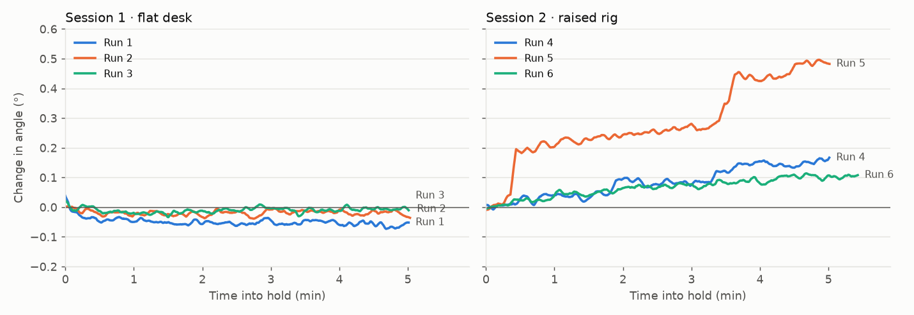

# Dual-IMU Goniometer — Static Stability Test Report

**Test dates:** 2026-09-23 and 2026-09-24 · **Hardware:** 2 × Arduino Nano 33 BLE Rev2 (BMI270), wired UART link · **Logger:** `knee_gui.py`

> Detailed analysis, per-run tables and method notes are in [FINDINGS.md](FINDINGS.md).
> This report summarises what the tests showed.

## Summary

With nothing moving, the goniometer's reading stays still. Jitter is about
**0.01°**, and on a stable setup the reading changed by **less than 0.1° over
5 minutes**, with no detectable drift. Every sample in all six runs was valid.

Testing also turned up three problems to fix before dynamic (movement) testing:

1. **The sample rate is ~40 Hz, not the configured 50 Hz**, and ~20 % of CSV rows
   are duplicates. The static results are unaffected.
2. **The ruler-side node's sensor can go bad.** In one recording it reported
   spinning while completely still, and the valid-sample rate fell to 93 %.
3. **Only one of the two sensors was exercised** by these tests, because of how
   calibration works when one node never tilts.

## Purpose

To check **stability, not accuracy**: if nothing moves, does the measured angle
also stay unchanged? No reference angle was used, so absolute accuracy is out of
scope.

## Setup

| | Session 1 (runs 1–3) | Session 2 (runs 4–6) |
|---|---|---|
| Date | 2026-09-23 | 2026-09-24 |
| Rig | Both nodes on a flat desk | Raised rig: desk node ~1 cm higher, ~5 cm apart, roughly in line |
| Thigh node | Taped to the desk | Taped to the rig |
| Shank node | Taped to a ruler | Taped to a ruler |
| Firmware | Original | Emit-timer change (no effect, see issue 1) |
| Duration | ~5 min per run | ~5–5.5 min per run |

**Procedure (every run):**
1. **Zeroing, 2 s:** both nodes held still. This pose becomes 0°.
2. **Calibration sweep, 6 s:** the ruler rotated ~90° and returned, so the software
   learns the direction it bends in.
3. **Hold, ~5 min:** nothing touched.

The first 20 s (calibration plus setting the ruler down) are excluded from the analysis.

## Results

### The reading stays still when nothing moves

*Change in the measured angle during each hold (5 s rolling average), relative
to the first 10 s of the hold.*

| Run | Resting angle | Jitter (SD) | Change over the hold | Drift |
|---|---|---|---|---|
| 1 | −0.30° | 0.015° | −0.06° | −0.005 °/min |
| 2 | −0.02° | 0.011° | −0.03° | −0.0003 °/min |
| 3 | +0.03° | 0.011° | −0.01° | +0.001 °/min |
| 4 | +6.38° | 0.016°\* | +0.16° | +0.033 °/min |
| 5 | −1.27° | 0.047°\* | +0.49° (two steps) | +0.082 °/min |
| 6 | −0.84° | 0.012°\* | +0.11° | +0.019 °/min |

\*Session 2 SD with the slow trend removed, so it measures jitter rather than the creep.

- **Session 1 (flat desk):** the reading moved by 0.06° at most over 5 minutes,
  and the drift direction flips between runs. That's noise, not drift.
- **Session 2 (raised rig):** the reading crept by 0.1–0.5°. Run 5 has two sudden
  steps. The desk node, which isn't part of the angle calculation, moved at the
  same time, so the creep most likely comes from the rig or wires settling rather
  than the sensor. Short-term jitter was the same as in session 1.
- **Resting angle** is where the ruler came to rest after the calibration sweep,
  relative to where it was zeroed. It reflects placement, and it stays constant
  during the hold.

### Noise does not grow with time

Allan deviation shows how much averages over a time window τ differ from one
window to the next. If it stayed flat or fell as τ grew, there's no drift at
those time scales.

| Averaging window τ | Session 1 | Session 2 |
|---|---|---|
| 0.1 s | 0.003° | 0.003° |
| 1 s | 0.005° | 0.005–0.007° |
| 60 s | 0.004–0.007° | — (rig creep dominates) |

Session 1 is flat from 10 s to 60 s, so no drift appears over these time scales.

### Other checks

- **Heading drift doesn't affect the angle.** Each sensor's heading (compass
  direction) drifted by 0.2–5 °/min, as expected without a magnetometer, and the
  angle ignored it in both sessions. That's by design.
- **Calibration copes with an imperfect setup.** In session 2 the ruler node was
  zeroed 4–15° off level, and the sweep was shorter (~55°) and in the opposite
  direction. Calibration still worked and the reading was just as steady.
- **Link reliability:** 100 % valid samples in all six runs, no dropouts.

## Issues found

### 1. Sample rate is ~40 Hz, not 50 Hz

| | Rate |
|---|---|
| Configured | 50 Hz |
| Produced by the central board | ~43.5 Hz (one sample every ~23 ms) |
| Unique samples in the CSV | ~40.5 Hz |
| CSV rows repeating the previous sample | 19–20 % |

**Cause.** The central board takes ~23 ms per output cycle instead of 20 ms. The
GUI writes a row every 20 ms whatever it has received, so when no new sample has
arrived it writes the previous one again. Repeated rows share the board's
timestamp (`t_thigh_us`), which confirms they are copies of the same measurement.

**Effect on these results: none.** With duplicates removed, every run's mean, SD
and drift are identical to within 0.0002°. For movement data it would matter:
repeated values, dropped samples, and row times up to ~20 ms off.

**Status.**
- A first firmware fix to the output timer had no effect, which showed the
  problem is inside each output cycle.
- A diagnostic build is ready. It times the parts of that cycle; the suspects are
  about 36 separate print calls per line and slow sensor reads.
- Planned fixes:
  - Speed up the output cycle.
  - Write one CSV row per received sample, so duplicates can't happen.

### 2. The ruler-side node's sensor can go bad

In a separate 1-minute recording where nothing moved at all (the central board had
been running ~26 minutes since its last reset, from its `t_thigh_us` clock):

- **The ruler node's reported orientation spun** by a median of ~27° between
  consecutive samples, up to ~2000 °/s. The desk node stayed within 0.05°.
- **The ruler node stalled 26 times**, each for ~0.2 s. That matches its built-in
  sensor-restart routine firing repeatedly without fixing the problem.
- **Valid samples fell to 93 %.** The rest were gaps filled with the previous value.

This is consistent with the drop in data quality seen after ~15 minutes of
collection. It isn't caused by calibration or by the sample-rate issue. The
diagnostic build reports the ruler node's sensor health once a second, to show
when and how it fails.

### 3. Only the ruler node was tested

The angle is the difference between the two nodes' tilts, but the software only
uses a node's tilt if it moved at least 5° during the calibration sweep. The desk
node never did, so it was treated as fixed and the angle came from the ruler node
alone. Its own data shows it was just as stable (jitter ~0.01°, no drift), but a
future test should tilt both nodes during calibration.

## Limitations

- **Stability only, not accuracy.** There was no reference angle, and resting
  angles were at most 6.4°, too small to reveal scale errors.
- **Jitter is limited by the log format.** Angles are logged to 0.01°, so the
  ~0.01° jitter is an upper bound; the true sensor noise is probably lower.
- **5-minute holds.** Drift over longer periods isn't measured.
- **Rig vs. sensor.** Where the rig moved (session 2), its movement can't yet be
  separated from sensor drift. The GUI now logs the raw accelerometer, which
  will allow that.

## Next steps

| Step | Status |
|---|---|
| Run the diagnostic build past the ~15 min mark | Ready: flash both boards |
| Log the raw accelerometer in the CSV | Done (`knee_gui.py`) |
| Fix the sample rate (faster output cycle; one row per received sample) | After diagnostics |
| Investigate and fix the ruler-node sensor fault | After diagnostics |
| Log angles with more decimal places | To do |
| Stiffen the raised rig (clamp the ruler, fix both nodes rigidly) | To do |
| Tilt both nodes during calibration | Next test |
| Static test at known angles (30°, 45°, 90°) for accuracy | Next test |
| Longer static run (30–60 min) | Next test |

## Files

| File | Contents |
|---|---|
| [FINDINGS.md](FINDINGS.md) | Full analysis and per-run detail |
| `plot_report.py` | Recreates the figure above (needs the six CSVs in this folder) |
| `stats.py`, `calibration.py`, `plot.py`, `plot_session2.py` | Detailed statistics and plots |
